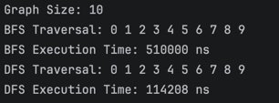
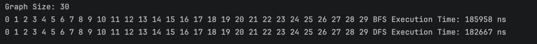
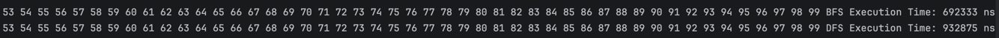

# ***Analysis Questions

## 1. How does graph size affect BFS and DFS performance?

When the graph becomes bigger, BFS and DFS need more time to work.  
A graph with more vertices and edges has more data to visit.

Small graphs are fast, while large graphs take longer.

---

## 2. Which traversal is faster in your experiments?

In my experiments, BFS and DFS had similar speed.  
Sometimes DFS was a little faster, but the difference was small.

---

## 3. Do results match the expected complexity O(V + E)?

Yes.  
The results match the expected complexity:

O(V + E)

Both algorithms visit each vertex and edge one time.

---

## 4. How does graph structure affect traversal order?

Graph structure changes the traversal order.

- BFS visits vertices level by level.
- DFS goes deep first and then comes back.

Different graph connections give different orders.

---

## 5. When is BFS preferred over DFS?

BFS is better when we need:
- the shortest path
- nearby vertices first
- minimum number of steps

BFS can find the shortest path in an unweighted graph.

---

## 6. What are the limitations of DFS?

DFS has some limitations:
- it does not always find the shortest path
- recursion can use a lot of memory
- it may go too deep before checking other paths


___
___
___
# ***Report Requirements

## A. Project Overview

A graph is a structure of vertices (nodes) and edges (connections).  
In this project, the graph is implemented using an adjacency list.

Two algorithms are used:

- BFS (Breadth-First Search) — explores level by level
- DFS (Depth-First Search) — goes deep before backtracking

---

## B. Class Descriptions

### Vertex
Stores vertex id.

### Edge
Represents connection between two vertices.

### Graph
Stores graph using adjacency list.

Methods:
- addVertex()
- addEdge()
- printGraph()
- bfs()
- dfs()

### Adjacency List
Each vertex has a list of its neighbors.  
Efficient for memory.

---

## C. Algorithm Descriptions

### BFS

Steps:
1. Start from node
2. Use queue
3. Visit neighbors level by level

Use cases:
- Shortest path
- Level traversal

Time Complexity:

```text
O(V + E)
```

---

### DFS

Steps:
1. Start from node
2. Use recursion
3. Go deep, then backtrack

Use cases:
- Cycle detection
- Path search

Time Complexity:

```text
O(V + E)
```

---

## D. Experimental Results

| Graph Size | BFS Time (ns) | DFS Time (ns) |
|---|---|---|
| 10 | 510000 | 114208 |
| 30 | 185958 | 182667 |
| 100 | 692333 | 932875 |

### Observations

- Execution time increased with graph size.
- BFS and DFS had similar performance on medium graphs.
- DFS was faster on the small graph.
- BFS was faster on the large graph.
- Results match the expected complexity O(V + E).

---

## Screenshots



---

## F. Reflection

This project helped me understand graph traversal and adjacency list representation. I learned how BFS and DFS work and how they visit vertices differently.

BFS explores level by level, while DFS explores deeply before backtracking. The main challenge was understanding recursive DFS and measuring execution time correctly.